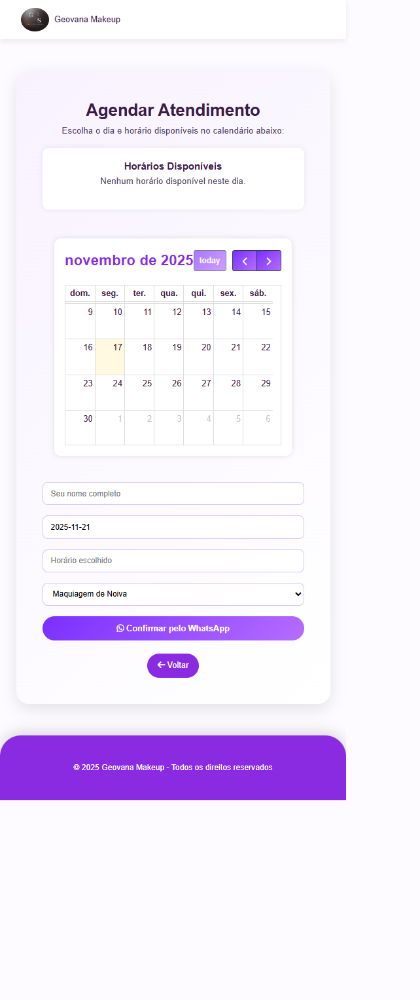

# Trabalho Prático 07 - Semanas 13 e 14

A partir dos dados cadastrados na etapa anterior, vamos trabalhar formas de apresentação que representem de forma clara e interativa as informações do seu projeto. Você poderá usar gráficos (barra, linha, pizza), mapas, calendários ou outras formas de visualização. Seu desafio é entregar uma página Web que organize, processe e exiba os dados de forma compreensível e esteticamente agradável.

Com base nos tipos de projetos escohidos, você deve propor **visualizações que estimulem a interpretação, agrupamento e exibição criativa dos dados**, trabalhando tanto a lógica quanto o design da aplicação.

Sugerimos o uso das seguintes ferramentas acessíveis: [FullCalendar](https://fullcalendar.io/), [Chart.js](https://www.chartjs.org/), [Mapbox](https://docs.mapbox.com/api/), para citar algumas.

## Informações do trabalho

- Nome: GEOVANA DE SOUZA FERREIRA
- Matricula: 1545034
Proposta de projeto escolhida: Organizações e Equipes
Breve descrição sobre seu projeto: O projeto Geovana Makeup é um sistema de agendamento e exibição de serviços de maquiagem. 

**Print da tela com a implementação**

o meu calendario é para mostrar e facilitar o agendamento das clientes, mostrando se tem horário disponivel ou não.

.png>)

